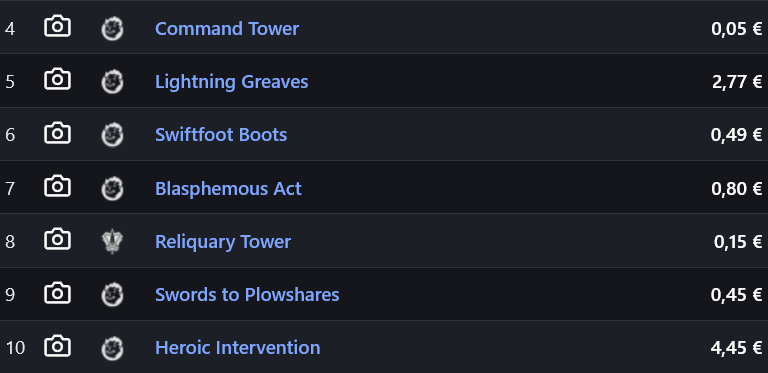
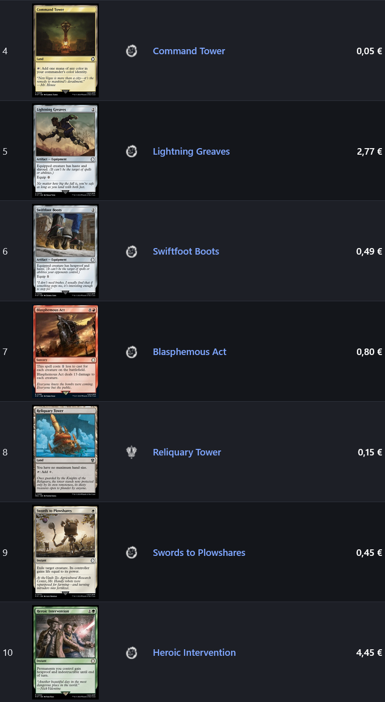
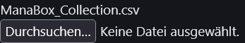
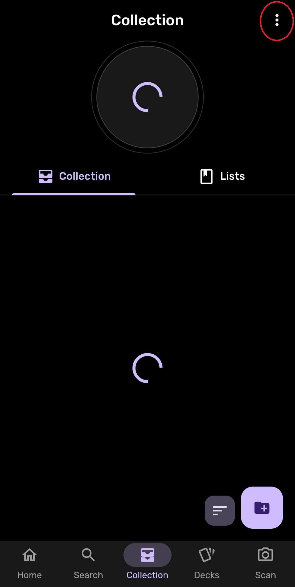
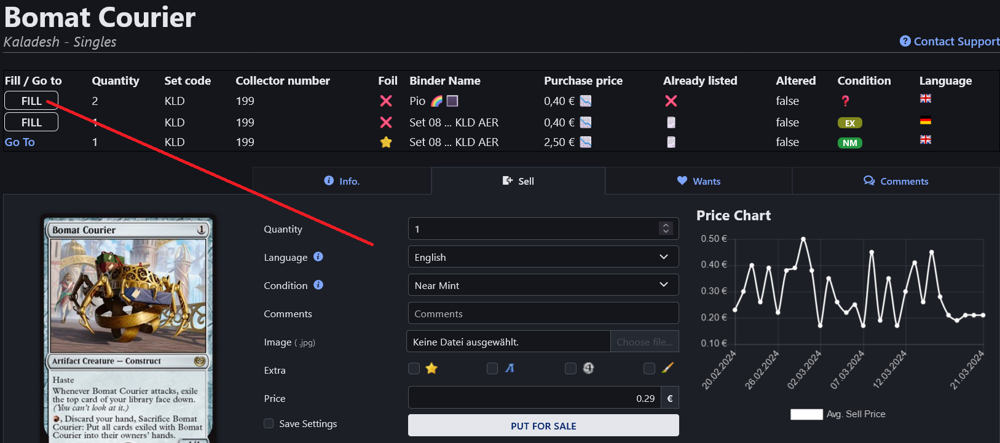
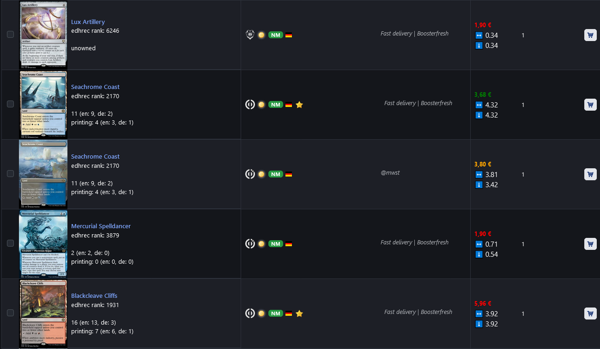
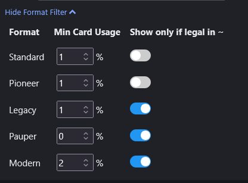
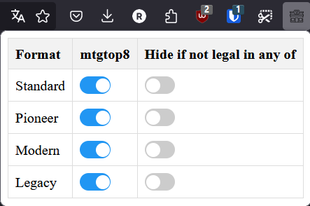
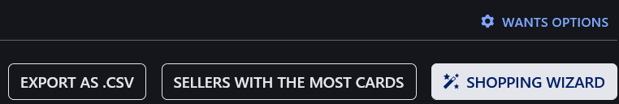

# Cardmarket Helper

https://addons.mozilla.org/en/firefox/addon/cardmarket-helper/

This Firefox-Addon is supposed to help in your everyday life with cardmarket.com

## Disclaimer

This add-on is not affiliated with, endorsed by, or in any way officially connected to Cardmarket. It is an independent, unofficial tool created to enhance the user experience on cardmarket.com

## [Release Notes / Changelog](CHANGELOG.md)

## Bug Reports / Feature Requests / Feedback

If you have any of those please feel free to submit them at https://github.com/SuppenNudel/cardmarket-helper/issues/new

## Development Setup

When loading this extension temporarily via `about:debugging`, Firefox MV3 treats `host_permissions` as optional. You must manually grant them:

1. Go to `about:addons`
2. Find "Cardmarket Helper"
3. Click on the extension name
4. Go to "Permissions" tab
5. Enable all listed permissions (Scryfall, Cardmarket downloads, GitHub)

**Note:** When the extension is signed and distributed through AMO, these permissions will be required at install time automatically.

## ManaBox Viewer target (for Orders export)

The **Open in ManaBox Viewer** button uses `config.manaboxViewerMode` from `browser.storage.sync`:

- `local` (default): opens `http://localhost:8000/index.html`
- `hosted`: opens `https://suppennudel.github.io/manabox-viewer/`

## Inspirations

Some Features of this addon have been inspired by existing addons. So I wanted to credeit them here:

### [Better Cardmarket MTG unofficial](https://chromewebstore.google.com/detail/better-cardmarket-mtg-uno/fplghokcfgbdedalpmbmjlafpagclbef)
- [IMPLEMENTED] Kleine preview Bilder statt Kamera-Icon

### [Carmarket Format Filter](https://chromewebstore.google.com/detail/cardmarket-format-filter/okfobifncpmjgnccfacmfkdnkhjbiglp)
- [Source Code](https://github.com/Aeolic/cardmarket-filter)
- [IMPLEMENTED] Format Filter

### [Cardmarket Companion](https://chromewebstore.google.com/detail/cardmarket-companion/mpbncolfefkegmaccdejhngjcjkjoaep)
- [IMPLEMENTED] Angebote auslesen und Preisfeld ausfüllen

## Findings

### [Cardmarket Companion](https://chromewebstore.google.com/detail/cardmarket-companion/mpbncolfefkegmaccdejhngjcjkjoaep)
- Add-on with similar features

## Legacy Idea Documentation
### Improvements
- make a request to outside if a cardmarket id wasn't found on scryfall (to automate)

- offers-singles
    - when determining ownership of same card different printing, use oracle_id of scryfall instead of cardname
    - Staple Stempel
        - Commander: edhrec
        - Pioneer: Eigenanalyse von mtgtop8 oder thegathering.gg

- sell
    - redirect currently disabled

### Bugs
- when putting something in the shopping cart, the camera icon reappears

### Figure out
- some cars on mkm have the same id but there are multiple entries in scryfall
    - Example Coastal Tower 8ED -> normal / foil

    - check if there is a foil version of the card in the same set with the same collector number

- some cards have the same id on scryfall but multiple on mkm
    - Example Mystical Archive Abundant Harvest - normal / foil and etched
 
 # Features (needs updating)

 ## Display Thumbnails

Before

Instead of the camera icon, the card's image get's displayed directly.

This change is made everywhere on cardmarket where you would see those photo camera icons, even on non-Magic pages)

⚠️ Temporarily Disabled as of 1.9.0: Since 1.1.0: In the settings menu you can adjust the size of the Thumbnail and toggle this feature on/off

After

## Upload ManaBox collection

When you select your ManaBox file, its content gets loaded and the page automatically gets reloaded in order to fill out the page with all the necessary info.

ℹ️ There will be a pop-up alert with “<filename>: undefined”. This is unwanted behavior but does not impact functionality.

To export your collection from ManaBox go into the top right menu and select “Export” (you need to confirm the following popup with another click on “Export”)

Then select where the export should go to. I always use Google Drive.

# Singles Page (Sell your cards)

### Printings of the current card that you own

When on a "Singles" page, and you have loaded your ManaBox collection, a table gets created which displays which printings of the card you are currently looking at you own.

### Go To (does not work currently 17. September 2025 )

If you click on this link you will get redirected to the cardmarket Singles page of this card.

### Fill Metrics

Click the “FILL” button to fill out the form.

If Condition is “MINT” a ❓gets displayed. This is to indicate that the condition of the card hasn’t been personally checked yet. A card should not be listed as MINT anyways in 99.9% of the cases.

Already listed should indicate if the card has been already put up for sale. It uses the “Misprint” metric of ManaBox (you need to update this in ManaBox yourself)

The “Price” field of the form gets filled out automatically by comparing the current LOW, TREND, AVG1, AVG7, AVG30 prices and the top few offers by other people.

Next to the “Purchase price” a stock market emoji is shown depending on if it is higher or lower than the automatically determined price from above.

## Offers Singles

### Metrics

| EDHREC Rank
(currently not enabled 17. September 2025) | The Ranking on [edhrec.com](http://edhrec.com)
Source: scryfall.com |
| --- | --- |
| Formats | Percentage of decks that used this card in the past 2 months in that format. In brackets is the average quantity of the card in the decks that use this card
In front of the slash is the data for the main board, behind is the data for sideboard.
Source: mtgtop8.com/topcards |
| Bottom Row | On the right it shows how many copies of any of the printings of the card you own in any language
and how many of any language you own for this specific printing (including foil and non-foil) |

### Format Filter

You can hide cards on a seller’s offer page

Version until before 1.9.0

⚠️ Disabled as of 1.9.0: You can modify which formats to analyze by going into the extension settings (left column)

With the right column you can let the extension hide rows if the card is not legal in one of the selected formats.

This function is turned of if no format is selected.

### Prices

⬇️ cardmarket low price

↔️ cardmarket average price

📈 cardmarket trend price

The coloring is dependend on the ratio between the offered price respective low/average/trend price
Within 10% it’s orange, if the offering is cheaper than that it is green, if it is more expensie it is red

## Export Wants-List (since 1.2.0)

With a click on the “Export as .csv”-Button you can export your currently shown Wants-List as a csv file.
